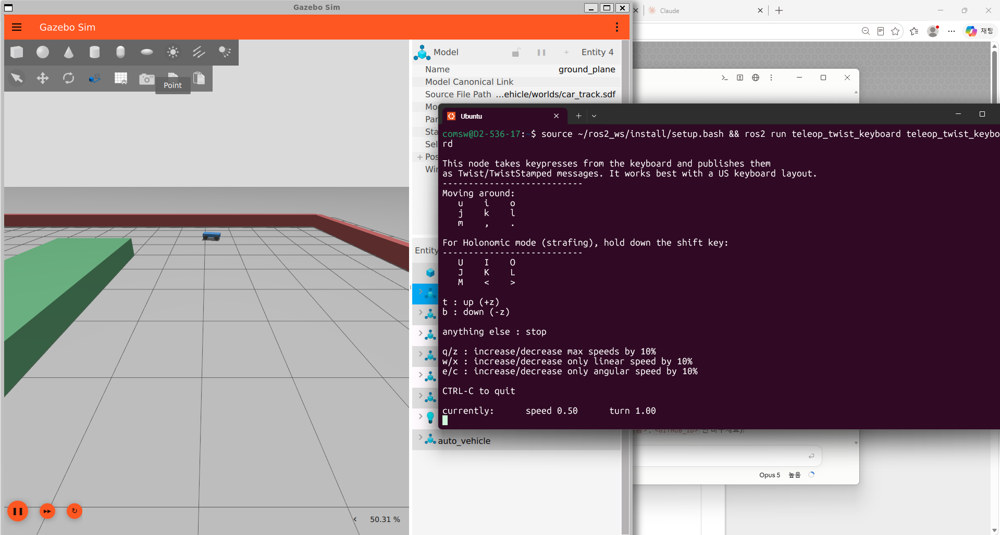
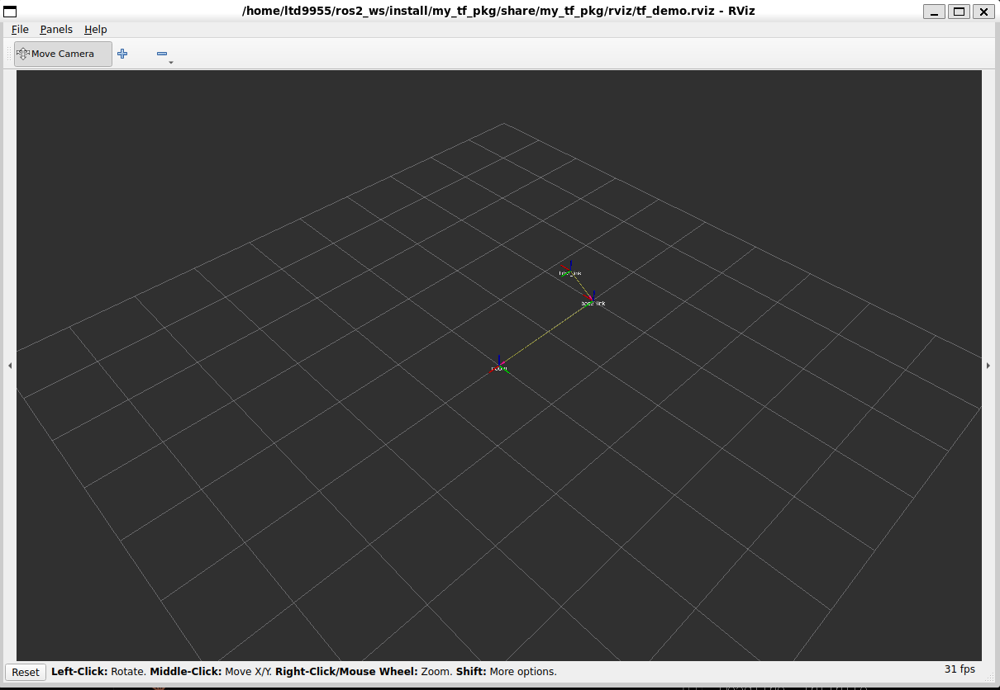
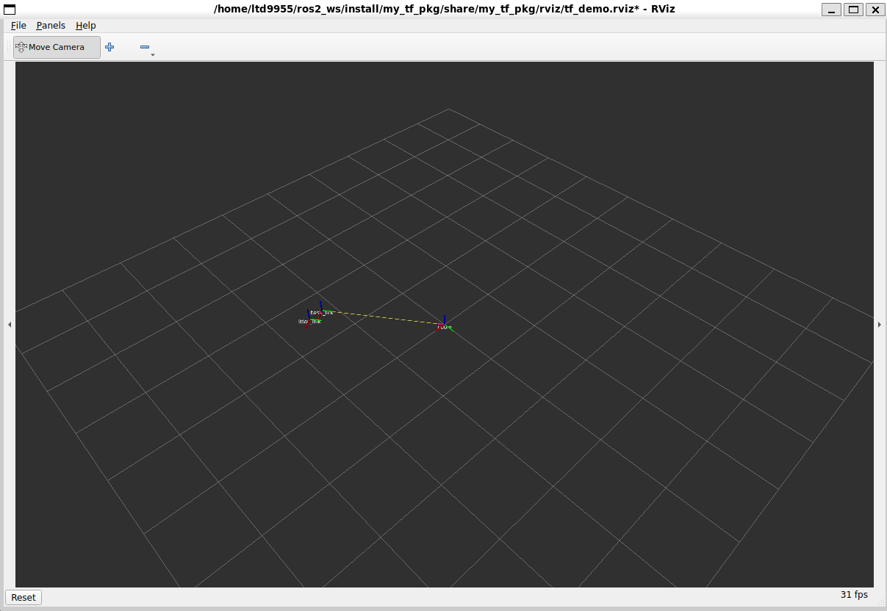
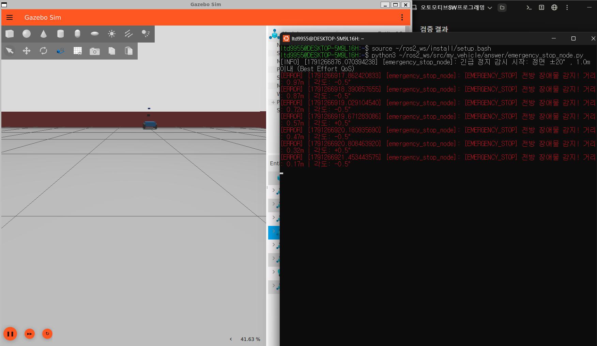
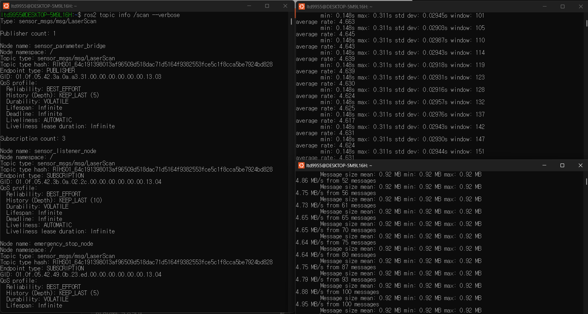

# my_vehicle — 오토모티브 SW프로그래밍 실습 (2·3·4·5·6주차)

주차별 실습을 **하나의 ROS 2 워크스페이스형 저장소**로 정리했습니다. 저장소를 `~/ros2_ws/src`에 clone하면 아래 패키지 4개가 한 번에 빌드됩니다.

- ROS 2 배포판: `lyrical` (Ubuntu 26.04 / WSL2)
- Gazebo Sim: `gz sim` 10.x (`ros-lyrical-ros-gz`)

> **6주차 과제**: 센서 시뮬레이션 통합과 Best Effort QoS → [3.5절](#35-6주차-my_sensor_pkg--answer--센서-통합과-best-effort-qos), AI 활용과 본인 보강 내용 → [6절](#6-ai-활용-내용과-본인-보강-내용)

## 1. 저장소 구조

```
my_vehicle/                     # 저장소 루트 (colcon이 하위 패키지를 자동 탐색)
├── my_vehicle_pkg/             # [2주차] Topic 통신 (publisher / subscriber / launch)
│   ├── my_vehicle_pkg/         #   simple_publisher.py, simple_subscriber.py
│   └── launch/vehicle_demo.launch.py
├── my_vehicle/                 # [3·4·6주차] URDF/Xacro 차량 + RViz2 + Gazebo + ros_gz_bridge
│   ├── launch/                 #   display.launch.py, spawn_car.launch.py
│   ├── urdf/                   #   vehicle.urdf.xacro, wheel_macro.xacro, vehicle_sensors.xacro(6주차)
│   ├── worlds/car_track.sdf    #   16m x 16m 트랙, 외곽벽, 중앙 분리대, (도전) 15° 경사로
│   ├── config/bridge.yaml      #   /clock, /cmd_vel, /odom, /tf, /joint_states 브릿지
│   └── rviz/display.rviz
├── my_tf_pkg/                  # [5주차] static / dynamic TF 브로드캐스터, TF2 리스너
│   ├── my_tf_pkg/              #   static_tf_broadcaster.py, dynamic_tf_broadcaster.py, tf_listener.py
│   ├── launch/tf_demo.launch.py
│   └── rviz/tf_demo.rviz
├── my_sensor_pkg/              # [6주차] 센서 브릿지 + 센서 수신 노드
│   ├── my_sensor_pkg/sensor_listener.py
│   ├── config/sensor_bridge.yaml
│   └── launch/sensors_sim.launch.py
├── answer/                     # [6주차 과제 1]
│   └── emergency_stop_node.py
├── screenshots/                # [6주차 과제 2] 실행 화면 캡처
│   ├── sensor_profiling.png
│   └── emergency_stop.png
└── docs/                       # 3·4·5주차 실행 결과 캡처
```

## 2. 설치 및 빌드

```bash
sudo apt update
sudo apt install python3-colcon-common-extensions ros-lyrical-ros-gz \
                 ros-lyrical-teleop-twist-keyboard ros-lyrical-joint-state-publisher-gui \
                 ros-lyrical-robot-state-publisher ros-lyrical-xacro ros-lyrical-tf2-tools \
                 liburdfdom-tools graphviz git

mkdir -p ~/ros2_ws/src && cd ~/ros2_ws/src
git clone https://github.com/ltd9955/my_vehicle.git
cd ~/ros2_ws
colcon build --symlink-install
source install/setup.bash
```

WSL2에서 RViz2/Gazebo 창이 뜨지 않거나 렌더링 에러가 나면 Qt를 X11로 지정합니다.

```bash
echo "export QT_QPA_PLATFORM=xcb" >> ~/.bashrc
```

`--symlink-install`로 빌드하면 RViz2를 종료할 때 나오는 저장 확인 창에서 저장하지 않는 것이 좋습니다. 설정 파일이 소스 폴더의 `.rviz`를 그대로 덮어씁니다.

## 3. 주차별 실행

### 3.1 [2주차] `my_vehicle_pkg` — Topic 통신

```bash
ros2 launch my_vehicle_pkg vehicle_demo.launch.py
```

퍼블리셔가 `/vehicle_status`(std_msgs/String)로 `Vehicle Speed: N km/h`를 1초마다 발행하고, 서브스크라이버가 `Subscribed: ...`로 수신합니다. 두 노드가 실행 중일 때 디스커버리와 QoS를 확인할 수 있습니다.

```bash
ros2 node list
ros2 topic info /vehicle_status --verbose   # Publisher/Subscriber 모두 RELIABLE, VOLATILE, KEEP_LAST(10)
ros2 topic hz /vehicle_status               # 약 1.0 Hz
```

### 3.2 [3주차] `my_vehicle` — RViz2 시각화

```bash
ros2 launch my_vehicle display.launch.py
```

Joint State Publisher 슬라이더를 움직이면 RViz의 조향/바퀴 관절이 따라 움직입니다.

### 3.3 [4주차] `my_vehicle` — Gazebo 시뮬레이션

터미널 1 — Gazebo 기동 + 차량 스폰 + 브릿지:

```bash
ros2 launch my_vehicle spawn_car.launch.py
```

터미널 2 — 키보드 주행 (`i` 전진, `u`/`o` 전진하며 좌/우, `k` 정지):

```bash
ros2 run teleop_twist_keyboard teleop_twist_keyboard
```

터미널 3 — 오도메트리 / 시계 확인:

```bash
ros2 topic echo /odom --no-arr
ros2 topic hz /clock
```

(도전) `worlds/car_track.sdf` 맨 아래 `ramp_15deg` 모델의 주석을 해제하면 스폰 위치 앞 4 m 지점에 15° 경사로가 생성됩니다. `urdf/wheel_macro.xacro`의 `mu1/mu2`를 바꿔 가며 등판 여부를 비교할 수 있습니다.



### 3.4 [5주차] `my_tf_pkg` — 좌표계와 TF2

```bash
ros2 launch my_tf_pkg tf_demo.launch.py
```

| 노드 | 역할 |
|---|---|
| `static_tf_broadcaster` | `base_link → lidar_link` (x=0.5, z=0.3)를 `/tf_static`으로 1회 발행 |
| `dynamic_tf_broadcaster` | 반지름 2 m 원 궤도 주행에 따른 `odom → base_link`를 `/tf`로 30 Hz 발행 |
| `tf_listener` | 10 Hz로 `odom → lidar_link`를 `lookup_transform`으로 질의해 위치와 Yaw 출력 |
| `rviz2` | Fixed Frame `odom`, TF 디스플레이 (`rviz/tf_demo.rviz`) |

`tf_listener`가 `[TF 룩업 성공] odom -> lidar_link | 위치(...) | 원점거리=2.06m` 를 계속 출력하면 정상입니다.
원점거리 2.06 m는 원 궤도 반지름 2 m와 라이다 오프셋 0.5 m로 계산한 값 √(2² + 0.5²) ≈ 2.06 과 일치합니다.

launch를 켜 둔 채 다른 터미널에서 확인합니다.

```bash
ros2 run tf2_tools view_frames                    # frames_<시각>.pdf 생성
ros2 run tf2_ros tf2_echo odom lidar_link         # 실시간 Translation / Rotation
ros2 topic info /tf_static --verbose              # Durability: TRANSIENT_LOCAL
```

RViz2에서 `odom`, `base_link`, `lidar_link` 좌표축이 보이고, `base_link`가 원을 그리며 이동할 때 `lidar_link`가 앞쪽 오프셋을 유지한 채 함께 회전합니다.

| RViz2 TF 시각화 (1) | RViz2 TF 시각화 (2) |
|---|---|
|  |  |

| 확인 항목 | 결과 |
|---|---|
| TF 트리 (`docs/week5_frames.pdf`) | `odom → base_link`(30.2 Hz) → `lidar_link`(static), 단절·다중 부모 없음 |
| `tf2_echo odom lidar_link` | Translation, Quaternion, RPY가 원 궤도에 따라 변함 |
| `/tf_static` QoS | Publisher: RELIABLE, TRANSIENT_LOCAL, KEEP_LAST(1) / Subscriber: TRANSIENT_LOCAL |

> `tf_demo.launch.py`는 `odom → base_link`를 발행하므로 4주차 Gazebo(`spawn_car.launch.py`)와 동시에 실행하면 TF가 충돌합니다.

### 3.5 [6주차] `my_sensor_pkg` + `answer/` — 센서 통합과 Best Effort QoS

차량(`auto_vehicle`)에 3대 센서를 장착하고, `/scan`을 Best Effort QoS로 구독하는 전방 긴급 정지 경고 노드를 구현했습니다.

| 센서 | 설정 (`my_vehicle/urdf/vehicle_sensors.xacro`) | 토픽 |
|---|---|---|
| 2D LiDAR (`gpu_lidar`) | 360 샘플, 10 Hz, 0.15~20 m, 차체 기준 전방 0.5 m / 상방 0.3 m | `/scan` |
| RGB 카메라 | 640×480 R8G8B8, 30 Hz, 시야각 약 80°, 전방 0.4 m / 상방 0.5 m | `/camera/image_raw` |
| IMU | 50 Hz, 차체 중심 상방 0.1 m | `/imu/data` |

실행 (터미널 3개, 새 터미널마다 `source ~/ros2_ws/install/setup.bash`):

```bash
# 터미널 1 — Gazebo + 차량 스폰 + 센서 브릿지 + sensor_listener
ros2 launch my_sensor_pkg sensors_sim.launch.py

# 터미널 2 — 키보드 주행
ros2 run teleop_twist_keyboard teleop_twist_keyboard

# 터미널 3 — 과제 1: 전방 긴급 정지 경고 노드
python3 ~/ros2_ws/src/my_vehicle/answer/emergency_stop_node.py
```

#### 과제 1. 전방 긴급 정지 경고 노드 — `answer/emergency_stop_node.py`

- `/scan`을 `qos_profile_sensor_data`(Best Effort + Volatile + Keep Last 5)로 구독합니다.
- 각 인덱스의 각도를 `angle_min + i * angle_increment`로 계산하고 `[-π, π]`로 정규화합니다. 라이다 정면은 0.0 rad이므로 `abs(angle) <= math.radians(20)`인 인덱스(정면 ±20° 부채꼴)만 검사합니다. 정확히 ±20° 샘플이 부동소수점 오차로 빠지지 않도록 `1e-6`의 허용 오차를 두었습니다.
- `inf`/`nan`과 측정 범위 밖(`range_min`~`range_max`) 값은 버립니다.
- 부채꼴 안의 최근접 거리가 **1.0 m 이내**이면 `[EMERGENCY_STOP] 전방 장애물 감지!`를 ERROR 레벨(터미널에서 붉은색)로 출력합니다. 0.5초에 한 번만 출력해 로그가 넘치지 않게 했습니다.

검증 결과:

- 판정 함수 단위 검사 12가지 모두 통과 (정면 0.8 m·1.0 m 경계는 경고, 1.2 m·±25° 밖·좌측·후방·0.0 노이즈·전부 `inf`는 경고 없음, `angle_min=0`인 라이다 대응 포함)
- 시뮬레이션에서 동쪽 벽(x=8 m)을 향해 전진하면 벽이 1.0 m 이내로 들어온 순간부터 경고가 시작됩니다: 0.97 → 0.87 → 0.72 → 0.57 → 0.47 → 0.32 → 0.17 m, 각도는 약 ±0.5°. 1.0 m 밖에서는 경고가 없습니다.



#### 과제 2. 센서 데이터 통신 프로파일링 — `screenshots/sensor_profiling.png`



| 측정 | 결과 | 비고 |
|---|---|---|
| `ros2 topic hz /scan` | 평균 약 4.6 Hz | 설정 10 Hz. Gazebo RTF가 약 40~50 %라 비례해서 낮아짐 |
| `ros2 topic bw /camera/image_raw` | 메시지 0.92 MB, 약 4.7 MB/s | 640×480×3 B = 0.92 MB. 30 Hz 그대로면 약 27.6 MB/s |
| `ros2 topic info /scan --verbose` | Publisher `sensor_parameter_bridge`: `BEST_EFFORT`, `KEEP_LAST (5)`, `VOLATILE` / Subscription `sensor_listener_node`, `emergency_stop_node`: `BEST_EFFORT` | 발행자와 구독자 QoS 일치 |

센서 주기와 대역폭이 설정값보다 낮은 것은 센서가 시뮬레이션 시간 기준으로 동작하는데 WSL2에서 GPU 없이 소프트웨어 렌더링(카메라·라이다)을 하여 RTF가 1.0에 못 미치기 때문입니다.

## 4. 원본 코드에서 수정한 내용

### 3·4주차 (code03 + code04 통합)

| 항목 | 원본 | 통합 후 |
|---|---|---|
| 패키지 | `my_vehicle_description`, `my_vehicle_gazebo` 두 개 | `my_vehicle` 하나 |
| URDF 경로 | `spawn_car.launch.py`가 `../code03/urdf/`를 상대 참조 → colcon 설치 후 경로 깨짐 | 자기 패키지 `urdf/` 참조 |
| Gazebo 실행 | `gz` 명령 직접 호출 (`ExecuteProcess`) | `ros_gz_sim/gz_sim.launch.py` include |
| 구동 플러그인 | 없음 (`/cmd_vel`을 보내도 움직이지 않음) | `DiffDrive`(후륜), `JointStatePublisher` 추가 |
| 바퀴 마찰 | 없음 | 바퀴 4개에 `mu1/mu2 = 1.0` |
| `/joint_states` 브릿지 | ROS/Gazebo 토픽 이름이 같아 수신 안 됨 | Gazebo 쪽 `/world/car_track_world/model/auto_vehicle/joint_state`로 매핑 |
| RViz | 설정 없음 | `rviz/display.rviz`로 자동 설정 |
| `setup.py` | `resource/` 항목이 조건부 → ament 인덱스 미등록 가능 | 필수 항목으로 고정, `urdf/`, `rviz/` 설치 추가 |

### 5주차 (code05 → `my_tf_pkg`)

| 항목 | 원본 | 수정 후 |
|---|---|---|
| 패키지명 | launch는 `automotive_tf`, 슬라이드는 `my_tf_pkg` | `my_tf_pkg`로 통일 |
| 실행 파일명 | launch가 `static_tf_broadcaster.py` 처럼 `.py`를 붙여 호출 | `console_scripts` 엔트리포인트 등록, `.py` 제거 |
| launch | RViz2 실행 없음 | `rviz2` 노드와 `tf_demo.rviz` 추가 |
| `tf_listener.py` | `logger.warn()` 사용 → 이 ROS 버전(Python 3.14)에서 `AttributeError`로 노드 종료 | `logger.warning()`으로 변경 |

### 6주차 (code06 → `my_sensor_pkg` + `my_vehicle`)

| 항목 | 원본 (code06) | 수정 후 |
|---|---|---|
| `sensor_listener.py` | `logger.warn()` 사용 → `AttributeError`로 노드 종료 | `logger.warning()`으로 변경 |
| 월드 `car_track.sdf` | 센서 시스템 플러그인 없음 → `/scan`, `/camera/image_raw`, `/imu/data`가 발행되지 않음 | `gz-sim-sensors-system`(ogre2), `gz-sim-imu-system` 추가 |
| URDF | `vehicle_sensors.xacro`가 어디에도 연결되지 않음 | `my_vehicle/urdf/`로 옮기고 `vehicle.urdf.xacro`에서 include |
| `sensors_sim.launch.py` | 브릿지와 리스너만 실행, 패키지명 `automotive_sensors`, 실행 파일명 `.py` 포함 | 패키지명 `my_sensor_pkg`, 기존 `spawn_car.launch.py`(Gazebo + 스폰)를 include, 브릿지 설정은 설치 경로에서 로드 |
| `sensor_bridge.yaml` | `qos_profile` 없음 → 브릿지 발행자가 `RELIABLE`, depth 10 | 4개 항목에 `qos_profile: SENSOR_DATA` 추가 → `BEST_EFFORT`, depth 5 |
| 전방 긴급 정지 | 없음 (`sensor_listener`는 전 방향 최근접만 확인) | `answer/emergency_stop_node.py` 신규 |

#### 실측으로 확인한 브릿지 QoS (슬라이드와 다른 점)

슬라이드(6.4)는 "`ros_gz_bridge`는 센서 메시지 변환 시 기본적으로 `SensorDataQoS`(Best Effort)를 적용한다"고 설명하지만, 이 환경에서는 설정 없이 실행하면 `/scan` 발행자가 **`RELIABLE`**, `KEEP_LAST (10)`이었습니다.

| | 수정 전 | 수정 후 (`qos_profile: SENSOR_DATA`) |
|---|---|---|
| Publisher `sensor_parameter_bridge` | RELIABLE, KEEP_LAST (10), VOLATILE | **BEST_EFFORT**, KEEP_LAST (5), VOLATILE |
| Subscription (`sensor_listener_node`, `emergency_stop_node`) | BEST_EFFORT | BEST_EFFORT |

구독자가 Best Effort이고 발행자가 Reliable이어도 연결은 되지만(Best Effort 구독자는 Reliable 발행자와 호환), 발행자 쪽 Reliable은 패킷 손실 시 재전송 때문에 최신 프레임이 밀리는 Head-of-Line Blocking 위험이 있습니다. 그래서 브릿지 발행자도 센서 표준 프로파일로 맞췄습니다. 브릿지 YAML이 지원하는 QoS 키는 설치된 `ros_gz_bridge`로 시험해서 확인했습니다(`qos_profile`에 문자열 값 지정은 적용, 같은 이름의 중첩 항목이나 `reliability` 키 단독 지정은 적용되지 않음).

## 5. 데이터 흐름

4주차 (제어):

```
teleop_twist_keyboard ──/cmd_vel──▶ ros_gz_bridge ──▶ Gazebo DiffDrive ──▶ 후륜 구동
                                                            │
robot_state_publisher ◀──/joint_states── ros_gz_bridge ◀── JointStatePublisher
        │                                                   │
      /tf, /tf_static                    /odom, /tf(odom→base_footprint), /clock
```

6주차 (센서):

```
Gazebo gpu_lidar / camera / imu ──▶ sensor_parameter_bridge (BEST_EFFORT) ──┬─ /scan ───────────▶ emergency_stop_node
                                                                            ├─ /scan, /imu/data, /camera/image_raw ▶ sensor_listener
                                                                            └─ (측정) ros2 topic hz / bw / info
```

## 6. AI 활용 내용과 본인 보강 내용

### 사용한 AI 도구
Claude Code (Anthropic Claude)를 사용했습니다. 이 과제와 이전 주차 실습에서 아래 용도로 활용했습니다.

| 활용 내용 | 구체적인 도움 |
|---|---|
| 과제·자료 분석 | 슬라이드(`week06.pptx`)와 과제 안내문의 차이 비교, `code06` 파일별 문제점 분석 |
| 구조 설계 | 주차별 코드를 한 저장소의 여러 패키지로 통합하는 구조 제안, 센서 파이프라인 구성 순서 정리 |
| 코드 초안 | `answer/emergency_stop_node.py` 초안, `sensors_sim.launch.py` 개선안 |
| 디버깅 | `logger.warn` 제거로 인한 `AttributeError` 원인 파악, 센서 토픽이 발행되지 않는 원인(SDF 센서 시스템 플러그인 누락) 파악 |
| 트러블슈팅 | WSL2 네트워크/DNS, `QT_QPA_PLATFORM=xcb`, GitHub 토큰 인증, `ros2 topic info`의 디스커버리 지연 |
| 문서화 | 이 README의 초안 작성 |

### 주요 프롬프트 (요약)
- "week06.pptx와 코드06 폴더, 과제 내용이 PPT 실습과 같은지 확인하고 내가 해야 할 순서를 정리해줘"
- "code06 안에 있는 자료를 최대한 활용해서 진행하는 방법을 정리해줘"
- "우분투 리눅스와 VS Code에서 어떻게 하는지 알려줘"
- "VS Code에서 수정해야 할 부분은 바로 수정해줘"
- "`ros2 topic info /scan --verbose` 결과가 이렇게 나왔는데 맞는지 확인해줘"

### 작업 분담: AI가 수행한 것 / 본인이 수행·확인한 것

**AI(Claude Code)가 수행한 것**
- `emergency_stop_node.py` 초안 작성과, 시뮬레이션 없이 합성 `LaserScan` 12개 케이스로 판정 로직을 검증하는 단위 검사. 이 검사에서 정확히 ±20° 샘플이 부동소수점 오차로 부채꼴에서 빠지는 결함이 발견되어 `1e-6` 허용 오차를 추가했습니다.
- 브릿지 YAML의 QoS 옵션 시험: 슬라이드의 "브릿지는 기본 Best Effort" 설명과 달리 발행자가 `RELIABLE`로 나오는 것을 확인했고, 임시 토픽에서 `qos_profile: SENSOR_DATA`가 적용되는 것을 확인한 뒤 `sensor_bridge.yaml`에 반영했습니다.
- `code06`의 결함(`warn()`, 월드의 센서 플러그인 누락, launch의 패키지명·불완전한 구성) 분석과 수정 제안, 빌드와 URDF 검사(`check_urdf`) 실행.

**본인이 수행·확인한 것**
- Ubuntu(WSL2)에서 `ros2 launch my_sensor_pkg sensors_sim.launch.py`로 시뮬레이션을 실행하고, teleop으로 차량을 벽 쪽으로 주행시켜 `/scan`, 카메라, 센서 수신 로그가 나오는 것을 확인했습니다.
- `emergency_stop_node.py`를 실행해 벽이 1.0 m 이내로 들어올 때부터 붉은 `[EMERGENCY_STOP]` 경고가 나오는 것을 확인하고 `screenshots/emergency_stop.png`로 캡처했습니다.
- `ros2 topic hz /scan`, `ros2 topic bw /camera/image_raw`, `ros2 topic info /scan --verbose`를 실행해 `screenshots/sensor_profiling.png`로 캡처했고, 브릿지 수정 전후의 `info --verbose` 결과를 비교했습니다.
- `my_sensor_pkg`의 `setup.py`, `package.xml`과 `vehicle.urdf.xacro`의 include 수정을 VS Code에서 직접 반영했습니다.

**측정값 해석**: `/scan` 4.6 Hz, 카메라 4.7 MB/s가 PPT 예시(10 Hz, 27.6 MB/s)보다 낮은 것은 Gazebo RTF가 약 40~50 %이고 WSL2에서 GPU 없이 소프트웨어 렌더링을 하기 때문으로 해석했습니다.

**알려진 한계(개선 과제)**: 라이다 `range_min`(0.15 m) 안쪽의 값은 무효값으로 처리되어 검사에서 제외되므로, 장애물이 그보다 가까워지면 경고가 멈출 수 있습니다. 이 노드는 경고만 출력하고 `/cmd_vel`로 정지 명령을 보내지는 않습니다(PPT 도전 과제의 긴급 제동은 미구현).
